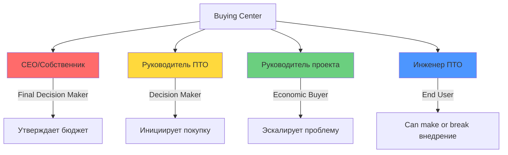

# Исследование целевой аудитории платформы автоматизации ИД

**Дата создания:** 2025-12-13
**Статус:** Завершено

---

## 📚 Структура документации

### 📊 Исследования и анализ

| Документ | Описание |
|----------|----------|
| [**target-audience-research.md**](target-audience-research.md) | Комплексное исследование целевой аудитории с сегментацией, анализом болей, buying center, стратегией GTM |
| [**anti-persona.md**](anti-persona.md) | Профили клиентов, с которыми НЕ стоит работать |
| [**onboarding-strategy.md**](onboarding-strategy.md) | Стратегия адаптации клиентов по ролям и этапам |

---

## 👥 Персоны пользователей (User Personas)

| Персона | Роль в покупке | Приоритет | Ключевые метрики |
|---------|----------------|-----------|------------------|
| [**Инженер ПТО**](persona-pto-engineer.md) | End User & Influencer | ⭐⭐⭐⭐⭐ | Экономия 85% времени |
| [**Руководитель отдела ПТО**](persona-pto-head.md) | Decision Maker | ⭐⭐⭐⭐⭐ | ROI 300-500%, окупаемость 1-2 мес |
| [**Руководитель проекта**](persona-project-manager.md) | Economic Buyer & Influencer | ⭐⭐⭐⭐ | Ускорение актов в 4x, высвобождение 1-3 млн руб |
| [**Собственник / CEO**](persona-ceo-owner.md) | Final Decision Maker | ⭐⭐⭐⭐⭐ | ROI 1260-1600%, экономия 39-49 млн руб/год |

---

## 🎯 Быстрая навигация по задачам

### Для продаж
- Изучите [целевую персону](target-audience-research.md#персоны) перед встречей
- Используйте [ключевые сообщения](target-audience-research.md#ключевые-сообщения-по-ролям) под роль
- Проверьте, не относится ли клиент к [anti-persona](anti-persona.md)

### Для маркетинга
- [Приоритизация сегментов](target-audience-research.md#приоритизация-сегментов) для таргетинга
- [Языки ценности](target-audience-research.md#разные-языки-ценности) для рекламных кампаний
- [Customer Journey Maps](persona-pto-engineer.md#customer-journey-map) для контент-стратегии

### Для продукта
- [Боли пользователей](target-audience-research.md#главные-боли) для приоритизации функционала
- [Стратегия онбординга](onboarding-strategy.md) для разработки UX
- [Метрики эффективности](target-audience-research.md#метрики-эффективности-работы-с-аудиторией) для product analytics

---

## 📈 Ключевые инсайты

**Вывод:** Решение о покупке — многоуровневое. Нужна персонализация под каждую роль.

---

## 🛣️ Стратегия выхода на рынок

**Tier 1 (фокус):** Средние/крупные генподрядчики + Аутсорсеры ПТО
**Tier 2:** Средние/крупные субподрядчики
**Tier 3:** Малые компании (после product-market fit)

Подробнее: [target-audience-research.md](target-audience-research.md#стратегия-выхода-на-рынок)

---

**Дата последнего обновления:** 2025-12-14
