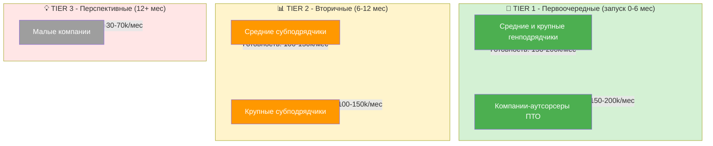

# Исследование целевой аудитории платформы автоматизации ИД

**Дата:** 2025-12-13
**Статус:** Исследование

---

## 1. Обзор целевой аудитории

### Общая характеристика
Все участники строительного процесса, которые занимаются подготовкой и сдачей исполнительной документации в строительстве.

### Географический охват
- **Первичный рынок:** Россия (стандарты ГОСТ, специфика российского строительства)
- **Потенциальное расширение:** Страны СНГ с аналогичными стандартами документации

---

## 2. Сегментация по размеру компании

### 2.1 Крупные строительные компании

**Характеристики:**
- Множество одновременных объектов (10+ объектов в работе)
- Годовой оборот: от 1 млрд руб.
- Штат инженеров ПТО: 10+ человек
- Отдел ПТО как отдельное подразделение

**Потребности:**
- Масштабируемость решения на все объекты
- Единая система учета и контроля ИД
- Интеграция с корпоративными системами (1С, СЭДО)
- Стандартизация процессов между объектами

**Боли:**
- Высокие затраты на ФОТ отдела ПТО
- Сложность контроля качества работы на всех объектах
- Длительные сроки сдачи объектов из-за ИД
- Критическая зависимость от ключевых специалистов

**Готовность платить:** Высокая (150-200 тыс. руб/мес)
**Приоритет для платформы:** ⭐⭐⭐⭐⭐ (Максимальный)

---

### 2.2 Средние строительные компании

**Характеристики:**
- Количество объектов: 3-10 одновременно
- Годовой оборот: 100-1000 млн руб.
- Штат инженеров ПТО: 3-10 человек
- ПТО часто совмещается с другими функциями

**Потребности:**
- Сокращение времени на подготовку ИД
- Снижение зависимости от конкретных специалистов
- Повышение качества документации
- Ускорение оборачиваемости средств

**Боли:**
- Нехватка квалифицированных инженеров ПТО
- Текучка кадров — потеря знаний
- Замечания от стройконтроля затягивают сдачу
- Ограниченный бюджет на автоматизацию

**Готовность платить:** Средне-высокая (100-150 тыс. руб/мес)
**Приоритет для платформы:** ⭐⭐⭐⭐ (Высокий)

---

### 2.3 Малые строительные компании

**Характеристики:**
- Количество объектов: 1-3
- Годовой оборот: до 100 млн руб.
- Штат инженеров ПТО: 1-3 человека или аутсорс
- Универсальные специалисты

**Потребности:**
- Максимальная простота использования
- Быстрое внедрение без обучения
- Минимальная стоимость
- Базовая автоматизация ключевых задач

**Боли:**
- Один человек делает всё — перегрузка
- Отсутствие специализированных знаний
- Ограниченный бюджет
- Зависимость от одного специалиста

**Готовность платить:** Низкая-средняя (30-70 тыс. руб/мес)
**Приоритет для платформы:** ⭐⭐ (Вторичный сегмент)

---

## 3. Сегментация по бизнес-модели

### 3.1 Генеральные подрядчики

**Характеристики:**
- Ответственны за весь объем ИД
- Координируют работу субподрядчиков
- Сдают комплектную ИД заказчику

**Особые потребности:**
- Контроль ИД от всех субподрядчиков
- Единый формат документации
- Быстрая сборка комплектов из разных источников
- Проверка на соответствие требованиям заказчика

**Ценность платформы:**
- Унификация ИД от разных субподрядчиков
- Автоматическая проверка комплектности
- Сокращение времени на сборку итогового пакета

**Приоритет:** ⭐⭐⭐⭐⭐

---

### 3.2 Субподрядчики

**Характеристики:**
- Работают по отдельным разделам/видам работ
- Сдают ИД генподрядчику
- Множество параллельных объектов у разных заказчиков

**Особые потребности:**
- Адаптация под требования разных генподрядчиков
- Быстрая подготовка документов по завершении работ
- Минимизация замечаний при приемке

**Ценность платформы:**
- Универсальные шаблоны под разные требования
- Скорость подготовки ИД
- Снижение количества итераций исправлений

**Приоритет:** ⭐⭐⭐⭐

---

### 3.3 Компании, работающие с ПТО на аутсорсе

**Характеристики:**
- Предоставляют услуги ПТО другим компаниям
- Обрабатывают ИД множества объектов
- Работают с разными стандартами и требованиями

**Особые потребности:**
- Максимальная производительность
- Гибкость настройки под разных заказчиков
- Масштабируемость на большое количество объектов
- Низкая себестоимость обработки одного объекта

**Ценность платформы:**
- Многократное увеличение производительности
- Снижение себестоимости услуг
- Возможность обслуживать больше клиентов меньшим штатом

**Приоритет:** ⭐⭐⭐⭐⭐ (Очень перспективный сегмент)

---

## 4. Сегментация по ролям (персоны пользователей)

### 4.1 Инженер ПТО (основной пользователь)

**Демография:**
- Возраст: 25-45 лет
- Образование: техническое, строительное
- Опыт работы: от 2 лет

**Должностные обязанности:**
- Сбор и проверка исполнительной документации
- Оформление актов и реестров
- Работа с документами качества
- Исправление замечаний от стройконтроля
- Взаимодействие с поставщиками и смежниками

**Ключевые боли:**
- **Монотонная рутинная работа** (80% времени)
- **Постоянные исправления замечаний** от стройконтроля
- **Поиск документов качества** в интернете часами
- **Ответственность за ошибки** при большом объеме работы
- **Цейтнот** при сдаче объектов
- **Низкая оценка труда** при больших трудозатратах

**Мотивация к использованию платформы:**
- Освобождение от рутины
- Снижение стресса и ответственности
- Возможность заниматься более сложными задачами
- Соблюдение сроков без авралов

**Возражения:**
- Страх потерять работу из-за автоматизации
- Недоверие к ИИ в точности документов
- Привычка к существующим процессам

**Приоритет:** ⭐⭐⭐⭐⭐ (Главный пользователь системы)

---

### 4.2 Руководитель отдела ПТО / Главный инженер ПТО

**Демография:**
- Возраст: 35-55 лет
- Образование: высшее техническое
- Опыт работы: от 10 лет

**Должностные обязанности:**
- Контроль качества и сроков подготовки ИД
- Распределение задач между инженерами
- Взаимодействие с руководством проекта
- Решение спорных вопросов со стройконтролем

**Ключевые боли:**
- **Сложность контроля качества** работы подчиненных
- **Зависимость от конкретных специалистов**
- **Непредсказуемые сроки** подготовки ИД
- **Высокая текучка кадров** — потеря знаний
- **Сложность масштабирования** отдела под новые объекты

**Мотивация к использованию платформы:**
- Стандартизация процессов
- Предсказуемость результата
- Снижение зависимости от людей
- Возможность масштабирования без найма

**KPI, на которые влияет платформа:**
- Скорость подготовки ИД
- Количество замечаний от стройконтроля
- Загрузка персонала
- Стоимость человеко-часа ИД

**Приоритет:** ⭐⭐⭐⭐⭐ (Ключевой decision maker)

---

### 4.3 Руководитель проекта / Директор стройки

**Демография:**
- Возраст: 35-60 лет
- Образование: высшее техническое
- Опыт работы: от 15 лет

**Должностные обязанности:**
- Управление всем строительным процессом
- Соблюдение сроков и бюджета
- Взаимодействие с заказчиком
- Закрытие актов выполненных работ

**Ключевые боли:**
- **ИД блокирует закрытие актов** и получение оплаты
- **Непрозрачность процесса** подготовки ИД
- **Срыв сроков сдачи объекта** из-за незакрытой ИД
- **Конфликты с заказчиком** по замечаниям в ИД

**Мотивация к использованию платформы:**
- Ускорение закрытия объемов
- Предсказуемость сроков сдачи
- Снижение финансовых рисков
- Контроль процесса в реальном времени

**KPI, на которые влияет платформа:**
- Скорость закрытия актов выполненных работ
- Оборачиваемость средств
- Соблюдение графика сдачи объекта

**Приоритет:** ⭐⭐⭐⭐ (Влиятельный stakeholder)

---

### 4.4 Собственник / Генеральный директор строительной компании

**Демография:**
- Возраст: 40-65 лет
- Образование: высшее (техническое или экономическое)

**Фокус внимания:**
- Прибыльность компании
- Масштабирование бизнеса
- Конкурентные преимущества
- Оптимизация издержек

**Ключевые боли:**
- **Высокие затраты на ФОТ** отдела ПТО
- **Замороженные средства** из-за незакрытой ИД
- **Сложность масштабирования** — нехватка специалистов
- **Риски от зависимости** от ключевых сотрудников

**Мотивация к использованию платформы:**
- ROI: экономия на зарплатах vs стоимость подписки
- Ускорение оборачиваемости средств
- Масштабируемость без пропорционального роста штата
- Конкурентное преимущество в сроках

**Decision making:**
- Принимает решение о покупке
- Оценивает финансовую эффективность
- Требует четкого ROI

**Приоритет:** ⭐⭐⭐⭐⭐ (Конечный decision maker)

---

## 5. Анализ болей и потребностей по сегментам

### 5.1 Общие боли всех сегментов

1. **Временные боли:**
   - Подготовка одного комплекта ИД: от 1 дня до месяца
   - Процесс сдачи ИД тянется годами
   - Постоянные итерации исправлений

2. **Качественные боли:**
   - Высокая вероятность ошибок при монотонной работе
   - Несоответствие требованиям стройконтроля
   - Потеря документов качества

3. **Экономические боли:**
   - Высокие затраты на ФОТ
   - Замороженные средства из-за незакрытой ИД
   - Штрафы за срыв сроков

4. **Организационные боли:**
   - Зависимость от конкретных людей
   - Сложность обучения новых сотрудников
   - Невозможность быстро масштабироваться

---

### 5.2 Специфичные боли по сегментам

**Крупные компании:**
- Отсутствие единых стандартов между объектами
- Сложность консолидации данных
- Высокие интеграционные требования

**Средние компании:**
- Нехватка квалифицированных кадров
- Ограниченный бюджет на автоматизацию
- Необходимость быстрого ROI

**Аутсорсеры ПТО:**
- Необходимость высокой производительности
- Работа с разными стандартами заказчиков
- Низкая маржинальность услуг

---

## 6. Ценность платформы для разных сегментов

### 6.1 Экономическая ценность

**Для инженера ПТО:**
- Экономия времени: 85% на разработку, 95% на исправления
- Снижение стресса и переработок
- Возможность обрабатывать больше объектов

**Для руководителя отдела:**
- Снижение численности отдела в 2-3 раза
- Предсказуемость сроков
- Стандартизация качества

**Для руководителя проекта:**
- Ускорение закрытия актов на 70-80%
- Ускорение получения оплаты
- Снижение конфликтов с заказчиком

**Для собственника:**
- ROI: экономия 1-2 ЗП инженеров (100-200 тыс/мес) vs подписка (150-200 тыс/мес)
- Дополнительно: ускорение оборота средств (миллионы рублей)
- Масштабируемость без роста штата

---

### 6.2 Нематериальная ценность

1. **Снижение стресса и рисков**
   - Меньше ошибок
   - Меньше замечаний
   - Меньше конфликтов

2. **Профессиональный рост**
   - Освобождение от рутины
   - Возможность заниматься сложными задачами
   - Повышение ценности специалиста

3. **Конкурентные преимущества**
   - Быстрее конкурентов
   - Репутация надежного подрядчика
   - Возможность браться за больше проектов

---

## 7. Барьеры к внедрению

### 7.1 Технологические барьеры

- **Низкая:**
  - Недоверие к точности ИИ
  - Опасения по безопасности данных
  - Необходимость обучения персонала

**Способы преодоления:**
- Прозрачность работы ИИ-агентов
- Финальная проверка человеком
- Демонстрация точности на тестовых данных
- Простой, интуитивный интерфейс

---

### 7.2 Организационные барьеры

- **Средняя:**
  - Сопротивление изменениям
  - Страх сотрудников потерять работу
  - Инертность процессов

**Способы преодоления:**
- Позиционирование как помощник, а не замена
- Обучение и вовлечение сотрудников
- Демонстрация экономии времени, а не сокращения людей
- Поэтапное внедрение

---

### 7.3 Финансовые барьеры

- **Низкая для крупных и средних компаний:**
  - Стоимость подписки
  - ROI должен быть очевиден

**Способы преодоления:**
- Четкий расчет ROI
- Пилотный проект на одном объекте
- Гибкие тарифы (по количеству объектов)
- Демонстрация экономии не только на ЗП, но и на ускорении оборота средств

---

## 8. Приоритизация сегментов

### Tier 1 (Первоочередные)
1. **Средние и крупные генподрядчики** ⭐⭐⭐⭐⭐
   - Максимальная готовность платить
   - Наибольшие боли
   - Очевидный ROI

2. **Компании-аутсорсеры ПТО** ⭐⭐⭐⭐⭐
   - Максимальная потребность в производительности
   - Готовность платить за эффективность
   - Быстрое внедрение (весь бизнес = ПТО)

### Tier 2 (Вторичные)
3. **Средние субподрядчики** ⭐⭐⭐⭐
   - Хорошая готовность платить
   - Значительные боли
   - Большой рынок

4. **Крупные субподрядчики** ⭐⭐⭐⭐
   - Высокая готовность платить
   - Специфичные требования

### Tier 3 (Перспективные, но не приоритет)
5. **Малые компании** ⭐⭐
   - Ограниченный бюджет
   - Требуют упрощенную версию
   - Большой рынок, но низкий чек

---

## 9. Рекомендации по работе с аудиторией

### 9.1 Стратегия выхода на рынок

**Этап 1: Внутреннее использование**
- Тестирование на собственных объектах
- Доработка функционала
- Сбор кейсов и метрик

**Этап 2: Пилотные клиенты**
- 2-3 средние/крупные компании
- Желательно — генподрядчики или аутсорсеры
- Работа с обратной связью
- Формирование кейсов

**Этап 3: Масштабирование**
- Активные продажи в Tier 1 сегменты
- Партнерства с крупными игроками
- Развитие сарафанного радио

---

### 9.2 Ключевые сообщения для разных ролей

**Для инженера ПТО:**
"Платформа освобождает вас от рутины и позволяет сосредоточиться на сложных задачах"

**Для руководителя отдела ПТО:**
"Стандартизируйте процессы и масштабируйте отдел без найма новых людей"

**Для руководителя проекта:**
"Закрывайте объемы в 5 раз быстрее и получайте оплату без задержек"

**Для собственника:**
"Окупаемость за 1-2 месяца: экономия на ФОТ + ускорение оборота средств на миллионы"

---

### 9.3 Каналы коммуникации

**Прямые продажи:**
- Холодные звонки в крупные строительные компании
- Встречи с руководителями проектов и отделов ПТО

**Сетевые каналы:**
- Отраслевые конференции и выставки
- Профессиональные сообщества строителей
- LinkedIn и специализированные форумы

**Партнерские каналы:**
- Партнерства с поставщиками стройматериалов
- Интеграции с популярным ПО (1С, СЭДО, CAD)
- Реферальные программы

**Контент-маркетинг:**
- Кейсы и расчеты ROI
- Обучающие материалы по ПТО
- Демонстрация работы платформы

---

## 10. Метрики успеха работы с аудиторией

### Метрики вовлеченности
- Количество зарегистрированных компаний
- Количество активных пользователей на объект
- Частота использования платформы

### Метрики удовлетворенности
- NPS (Net Promoter Score)
- Отзывы и рейтинги
- Количество рекомендаций

### Метрики эффективности
- Время подготовки ИД до/после
- Количество замечаний до/после
- ROI для клиента

### Метрики удержания
- Churn rate (процент отказов от подписки)
- Customer Lifetime Value
- Renewal rate (процент продления подписки)

---

## Заключение

Целевая аудитория платформы четко определена и имеет выраженные боли, которые решает продукт. Приоритетные сегменты — средние и крупные генподрядчики, а также компании-аутсорсеры ПТО — обладают максимальной готовностью платить и наибольшим объемом потребности.

Ключевой фактор успеха — фокус на конкретных ролях (инженер ПТО, руководитель отдела, руководитель проекта, собственник) с персонализированными сообщениями о ценности продукта для каждой роли.

Стратегия выхода на рынок должна начинаться с внутреннего использования и пилотных клиентов для доработки продукта и формирования убедительных кейсов, после чего масштабироваться на приоритетные сегменты.
