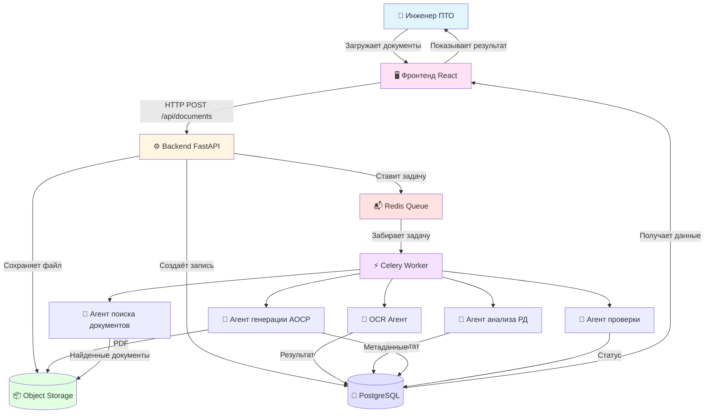
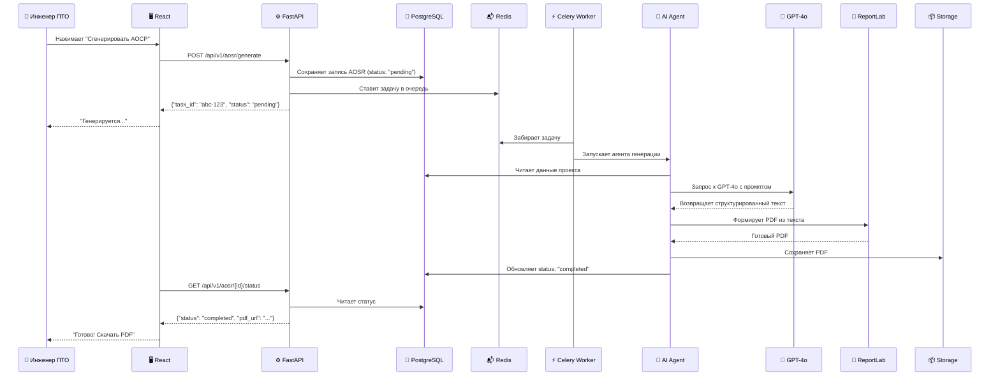

# Как работает платформа (простыми словами)

**Дата создания:** 2025-12-14
**Для кого:** Для всех, кто хочет понять, как устроена платформа изнутри

---

## 🎯 Главная задача

**Превратить:**
- Груду документов (проектная документация, сканы сертификатов, схемы)

**В:**
- Готовый комплект исполнительной документации (акты, реестры, всё оформлено по ГОСТу)

**За:**
- 1 день вместо недели

---

## 🏗️ Высокоуровневая архитектура

Представьте платформу как **конвейер на заводе**:

### Интерактивная диаграмма (Mermaid)



### Текстовая диаграмма (для терминала)

```
┌──────────────────────────────────────────────────────────────┐
│                    ЭТАП 1: ПРИЁМ ЗАКАЗА                       │
│                         (Фронтенд)                            │
├──────────────────────────────────────────────────────────────┤
│                                                               │
│  👤 Инженер ПТО открывает браузер                             │
│  → Заходит на платформу (React приложение)                    │
│  → Видит список своих проектов                                │
│  → Создаёт новый проект или выбирает существующий             │
│  → Загружает документы (PDF, Word, сканы)                     │
│                                                               │
└───────────────────────────┬───────────────────────────────────┘
                            │ Отправляет HTTP запрос
                            ▼
┌──────────────────────────────────────────────────────────────┐
│                  ЭТАП 2: ОБРАБОТКА ЗАКАЗА                     │
│                        (Backend API)                          │
├──────────────────────────────────────────────────────────────┤
│                                                               │
│  ⚙️ FastAPI принимает запрос                                  │
│  → Проверяет: пользователь авторизован?                       │
│  → Сохраняет файл в Object Storage (облачное хранилище)       │
│  → Создаёт запись в базе данных                               │
│  → Ставит задачу в очередь: "Обработать этот документ!"       │
│  → Возвращает фронтенду: "Принято, обрабатывается..."         │
│                                                               │
└───────────────────────────┬───────────────────────────────────┘
                            │ Задача в очередь
                            ▼
┌──────────────────────────────────────────────────────────────┐
│                  ЭТАП 3: ФОНОВАЯ ОБРАБОТКА                    │
│                      (Celery Workers)                         │
├──────────────────────────────────────────────────────────────┤
│                                                               │
│  📦 Celery берёт задачу из очереди (Redis)                    │
│  → "Нужно обработать документ проекта #123"                   │
│  → Запускает нужного ИИ-агента                                │
│  → Агент делает свою работу                                   │
│  → Результат сохраняется в базу данных                        │
│  → Статус обновляется: "Готово!"                              │
│                                                               │
└───────────────────────────┬───────────────────────────────────┘
                            │ ИИ-агенты работают
                            ▼
┌──────────────────────────────────────────────────────────────┐
│                     ЭТАП 4: ИИ-МАГИЯ                          │
│                        (AI Agents)                            │
├──────────────────────────────────────────────────────────────┤
│                                                               │
│  🤖 Разные агенты делают разную работу:                       │
│                                                               │
│  [Агент OCR]                                                  │
│  → Распознаёт текст на сканах документов                      │
│  → Извлекает: номер сертификата, дату, производителя          │
│                                                               │
│  [Агент анализа РД]                                           │
│  → Читает проектную документацию                              │
│  → Понимает: какие работы, какие материалы, сколько АОСР      │
│                                                               │
│  [Агент генерации АОСР]                                       │
│  → Берёт данные из РД                                         │
│  → Генерирует текст акта по шаблону ГОСТ                      │
│  → Создаёт PDF файл                                           │
│                                                               │
│  [Агент поиска документов]                                    │
│  → Ищет недостающие сертификаты в интернете                   │
│  → Проверяет: подходит ли найденный документ                  │
│  → Скачивает и добавляет в проект                             │
│                                                               │
│  [Агент проверки]                                             │
│  → Проверяет: все ли документы на месте?                      │
│  → Сверяет даты: нет ли несоответствий?                       │
│  → Формирует список замечаний                                 │
│                                                               │
└───────────────────────────┬───────────────────────────────────┘
                            │ Результаты в базу
                            ▼
┌──────────────────────────────────────────────────────────────┐
│                   ЭТАП 5: ХРАНЕНИЕ ДАННЫХ                     │
│                      (PostgreSQL)                             │
├──────────────────────────────────────────────────────────────┤
│                                                               │
│  💾 В базе данных хранится:                                   │
│  → Проекты (название, адрес, статус)                          │
│  → Документы (файлы, метаданные, OCR текст)                   │
│  → АОСР (содержимое, связь с документами)                     │
│  → История задач (что делали, когда, результат)               │
│                                                               │
└───────────────────────────┬───────────────────────────────────┘
                            │ Данные доступны
                            ▼
┌──────────────────────────────────────────────────────────────┐
│                  ЭТАП 6: ПОЛУЧЕНИЕ РЕЗУЛЬТАТА                 │
│                         (Фронтенд)                            │
├──────────────────────────────────────────────────────────────┤
│                                                               │
│  👤 Инженер видит:                                            │
│  → Прогресс-бар: "Обработка завершена"                        │
│  → Список готовых актов                                       │
│  → Кнопка "Скачать комплект ИД" (PDF)                         │
│  → Список замечаний (если есть)                               │
│                                                               │
│  Нажимает "Скачать" → получает готовый PDF                    │
│                                                               │
└──────────────────────────────────────────────────────────────┘
```

---

## 🔄 Полный жизненный цикл (пример)

Давайте проследим, что происходит, когда инженер ПТО готовит АОСР на монтаж труб:

### ШАГ 1: Инженер загружает документы

**Что делает пользователь:**
```
1. Открывает проект "ЖК Солнечный, корпус 1"
2. Нажимает "Загрузить проектную документацию"
3. Выбирает файл: "Раздел ОВ. Водоснабжение.pdf"
4. Нажимает "Загрузить"
```

**Что происходит внутри:**
```
Фронтенд (React):
├─ Валидирует файл (формат PDF, размер <50MB)
├─ Показывает прогресс-бар загрузки
└─ Отправляет POST запрос на /api/v1/documents/upload

Backend (FastAPI):
├─ Получает файл
├─ Проверяет авторизацию пользователя
├─ Сохраняет файл в Object Storage (Yandex Cloud)
├─ Создаёт запись в таблице `documents`:
│  ├─ filename: "Раздел ОВ. Водоснабжение.pdf"
│  ├─ project_id: 123
│  ├─ doc_type: "РД"
│  └─ file_path: "projects/123/docs/rd_12345.pdf"
├─ Ставит задачу в Celery: analyze_rd_task.delay(document_id=456)
└─ Возвращает: {"status": "processing", "task_id": "abc-123"}

Фронтенд показывает: "Документ загружен, анализируется..."
```

---

### ШАГ 2: ИИ анализирует проектную документацию

**Что происходит в фоне:**
```
Celery Worker поднимает задачу:
└─ "Нужно проанализировать документ ID 456"

Запускается Агент анализа РД:
├─ Скачивает PDF из Object Storage
├─ Извлекает текст через PyMuPDF
├─ Отправляет в GPT-4o с промптом:
│  """
│  Ты эксперт по строительной документации.
│  Проанализируй спецификацию и определи:
│  1. Какие виды работ нужно закрывать АОСР
│  2. Какие материалы используются
│  3. Количество и единицы измерения
│
│  [PDF текст...]
│  """
│
├─ GPT-4o возвращает JSON:
│  {
│    "works": [
│      {
│        "type": "Монтаж трубопроводов",
│        "materials": [
│          {"name": "Труба ПНД", "quantity": 150, "unit": "м", "gost": "ГОСТ 18599-2001"},
│          {"name": "Фитинги", "quantity": 25, "unit": "шт"}
│        ]
│      }
│    ]
│  }
│
└─ Сохраняет результат в таблицу `aosr`:
   ├─ project_id: 123
   ├─ work_type: "Монтаж трубопроводов"
   ├─ content: {JSON с работами и материалами}
   └─ status: "draft"
```

---

### ШАГ 3: Инженер запускает генерацию АОСР

**Что делает пользователь:**
```
1. Видит в интерфейсе: "Найдено 1 акт для генерации"
2. Нажимает "Сгенерировать АОСР №1"
3. Заполняет форму:
   - Дата работ: 2024-12-10
   - Ответственные лица: (выбирает из справочника)
4. Нажимает "Сгенерировать"
```

**Что происходит:**
```
Backend:
├─ Получает запрос: POST /api/v1/aosr/generate
├─ Ставит задачу: generate_aosr_task.delay(aosr_id=789)
└─ Возвращает: {"status": "generating", "task_id": "xyz-456"}

Celery Worker:
└─ Агент генерации АОСР:
   ├─ Загружает данные из базы (work_type, materials, etc)
   ├─ Использует шаблон ГОСТ для АОСР
   ├─ Заполняет шаблон данными
   ├─ Генерирует PDF через ReportLab
   ├─ Сохраняет PDF в Object Storage
   └─ Обновляет запись в БД:
      ├─ status: "generated"
      ├─ generated_pdf_path: "projects/123/aosr/aosr_789.pdf"
      └─ generated_at: "2024-12-14 10:30:00"
```

---

### ШАГ 4: Поиск документов качества

**Параллельно запускается:**
```
Агент поиска документов качества:
├─ Берёт список материалов из АОСР:
│  ["Труба ПНД ГОСТ 18599-2001", "Фитинги"]
│
├─ ДЛЯ КАЖДОГО МАТЕРИАЛА:
│  ├─ 1. Ищет в локальной базе загруженных документов проекта
│  │     SELECT * FROM documents
│  │     WHERE project_id = 123
│  │     AND ocr_text LIKE '%Труба ПНД%'
│  │     AND ocr_text LIKE '%ГОСТ 18599-2001%'
│  │
│  ├─ 2. Если НЕ найдено → поиск в интернете:
│  │     ├─ Playwright открывает браузер
│  │     ├─ Заходит на https://www.santech.ru/
│  │     ├─ Ищет "Труба ПНД ГОСТ 18599-2001 сертификат"
│  │     ├─ Скачивает PDF сертификата
│  │     ├─ Отправляет GPT-4o: "Подходит ли этот сертификат?"
│  │     └─ Если подходит → сохраняет в проект
│  │
│  └─ 3. Если всё равно НЕ найдено:
│        └─ Агент генерации документов создаёт паспорт качества
│
└─ Создаёт связи в таблице `aosr_quality_documents`:
   ├─ aosr_id: 789
   ├─ document_id: 234 (сертификат на трубу)
   └─ relevance_score: 0.95
```

---

### ШАГ 5: Проверка комплектности

```
Агент проверки:
├─ Проверяет АОСР ID 789:
│  ├─ Есть ли все документы на материалы? ✅
│  ├─ Проверка дат:
│  │  ├─ Дата работ: 2024-12-10
│  │  ├─ Дата поставки (из паспорта): 2024-11-15 ✅
│  │  ├─ Срок действия сертификата: до 2027-01-01 ✅
│  │  └─ Всё логично? ✅
│  │
│  └─ Результат: "Комплект готов к сдаче, замечаний нет"
│
└─ Обновляет статус: status = "approved"
```

---

### ШАГ 6: Формирование финального комплекта

**Пользователь нажимает: "Скачать комплект ИД"**

**Детальное описание этого этапа:** См. [10-final-package-generation.md](10-final-package-generation.md)

```
Backend:
├─ Собирает метаданные всех документов проекта:
│  ├─ Все АОСР с номерами и датами
│  ├─ Исполнительные схемы (приложения к АОСР)
│  ├─ Документы качества (сертификаты, паспорта, декларации)
│  └─ Рассчитывает нумерацию страниц для реестра
│
├─ Генерирует титульный лист:
│  ├─ Название объекта
│  ├─ Застройщик, подрядчик, генподрядчик
│  └─ Период выполнения работ
│
├─ Генерирует реестр исполнительной документации:
│  ├─ Таблица с 7 колонками (№ п/п, Наименование, Содержание, № документа, Дата, Кол-во листов, Страница)
│  ├─ Все документы пронумерованы последовательно
│  └─ Указаны точные номера страниц в итоговом PDF
│
├─ Объединяет все документы в единый PDF (PyPDF2):
│  ├─ 1. Титульный лист
│  ├─ 2. Реестр исполнительной документации (2-3 страницы)
│  ├─ 3. АОСР №1
│  ├─ 4. Исполнительная схема к АОСР №1
│  ├─ 5-8. Документы качества (сертификаты, паспорта)
│  ├─ 9. АОСР №2
│  ├─ 10. Исполнительная схема к АОСР №2
│  └─ ... (все остальные АОСР)
│
├─ Создаёт архив ZIP с редактируемыми файлами:
│  ├─ 1. Исполнительная документация в формате PDF/
│  │  └─ [все PDF файлы отдельно]
│  ├─ 2. Исполнительная документация в формате Excel/
│  │  ├─ Общий реестр.xlsx (редактируемая таблица)
│  │  └─ АОСР №1.xlsx, АОСР №2.xlsx (на основе шаблона)
│  ├─ 4. Геодезические схемы в формате DWG/
│  │  └─ [исполнительные схемы в AutoCAD формате, если есть]
│  └─ 5. Паспорта, сертификаты и лабораторные заключения/
│     └─ [все документы качества]
│
├─ Загружает файлы в Object Storage
└─ Возвращает URL для скачивания:
   ├─ PDF: "ИД_ЖК_Солнечный_Полный_комплект.pdf" (45MB, 250 страниц)
   └─ ZIP: "ИД_ЖК_Солнечный_Архив.zip" (30MB, все редактируемые файлы)

Пользователь скачивает готовый комплект в двух форматах!
```

**Время генерации:** ~2 минуты (с отслеживанием прогресса в реальном времени)

---

## 🧩 Как компоненты взаимодействуют

### Пример: Генерация АОСР

#### Интерактивная диаграмма (Mermaid)



#### Текстовая диаграмма (для терминала)

```
┌────────────┐
│  Фронтенд  │
│   (React)  │
└──────┬─────┘
       │ POST /api/v1/aosr/generate
       ▼
┌────────────┐
│  Backend   │──────┐
│  (FastAPI) │      │ Сохраняет в БД
└──────┬─────┘      │
       │            ▼
       │      ┌──────────────┐
       │      │  PostgreSQL  │
       │      └──────────────┘
       │ Ставит задачу
       ▼
┌────────────┐
│   Celery   │
│   Worker   │
└──────┬─────┘
       │ Вызывает агента
       ▼
┌────────────┐
│ AI Agent   │──────┐
│ (LangChain)│      │ Запрос к LLM
└──────┬─────┘      │
       │            ▼
       │      ┌──────────────┐
       │      │   OpenAI     │
       │      │   GPT-4o     │
       │      └──────────────┘
       │ Генерирует PDF
       ▼
┌────────────┐
│ ReportLab  │
│ PDF Gen    │
└──────┬─────┘
       │ Сохраняет файл
       ▼
┌────────────┐
│  Object    │
│  Storage   │
└────────────┘
```

---

## 🔐 Безопасность на каждом этапе

```
Пользователь → Фронтенд:
├─ HTTPS (SSL/TLS) — шифрование трафика
└─ JWT токен — аутентификация

Фронтенд → Backend:
├─ Валидация всех данных (Pydantic)
├─ Rate Limiting (не более 100 запросов/мин)
└─ CORS (только с разрешённых доменов)

Backend → База данных:
├─ Подготовленные запросы (защита от SQL Injection)
├─ Хеширование паролей (bcrypt)
└─ Шифрование чувствительных данных

Backend → Object Storage:
├─ Приватные бакеты (файлы не доступны публично)
├─ Подписанные URL (временный доступ)
└─ Проверка формата файлов (защита от вирусов)
```

---

## ⚡ Производительность

### Что происходит быстро:
- ✅ Загрузка интерфейса: <1 сек
- ✅ Загрузка файла: зависит от скорости интернета
- ✅ API запросы: <100ms

### Что занимает время:
- ⏳ Анализ РД: 30-60 сек (зависит от размера документа)
- ⏳ Генерация АОСР: 10-20 сек
- ⏳ Поиск документов в интернете: 2-5 мин (на каждый материал)
- ⏳ OCR скана: 5-10 сек на страницу

**Решение:** Всё делается в фоне (Celery), пользователь не ждёт!

---

## ⚠️ Обработка ошибок (Error Handling)

### Что может пойти не так?

#### 1. Ошибка при загрузке файла

**Проблема:** Файл слишком большой или неверный формат

**Что происходит:**
```python
# Backend проверяет размер и тип
if file_size > 50 * 1024 * 1024:  # > 50MB
    raise HTTPException(
        status_code=400,
        detail="Файл слишком большой (максимум 50MB)"
    )

if mime_type not in ['application/pdf', 'application/msword']:
    raise HTTPException(
        status_code=400,
        detail="Неподдерживаемый формат файла"
    )
```

**Что видит пользователь:**
> ❌ Ошибка загрузки: Файл слишком большой (максимум 50MB)

---

#### 2. Ошибка анализа РД (GPT-4o не отвечает)

**Проблема:** OpenAI API недоступен или вернул ошибку

**Что происходит:**
```python
from tenacity import retry, stop_after_attempt, wait_exponential

@retry(
    stop=stop_after_attempt(3),  # Пробуем 3 раза
    wait=wait_exponential(min=4, max=60)  # Ждём 4, 16, 60 секунд
)
def analyze_rd_with_retry(document_text):
    try:
        response = openai.chat.completions.create(
            model="gpt-4o",
            messages=[{"role": "user", "content": prompt}],
            timeout=120  # Таймаут 2 минуты
        )
        return response
    except openai.APIError as e:
        logger.error(f"OpenAI API error: {e}")
        raise  # Retry сработает автоматически
    except openai.Timeout:
        logger.error("OpenAI timeout")
        raise
```

**Fallback (если все retry не помогли):**
```python
# Используем упрощённый анализ без LLM
def fallback_analysis(document_text):
    # Простой поиск по ключевым словам
    materials = extract_materials_by_keywords(document_text)
    return {"works": [{"materials": materials}]}
```

**Что видит пользователь:**
> ⚠️ Анализ выполнен в упрощённом режиме. Проверьте результаты вручную.

---

#### 3. Документ качества не найден

**Проблема:** Агент поиска не нашёл сертификат в интернете

**Что происходит:**
```python
def search_document_with_fallback(material):
    # Шаг 1: Поиск в интернете
    result = search_online(material)
    if result:
        return result

    # Шаг 2: Если не найдено → генерируем паспорт качества
    logger.warning(f"Document not found for {material}, generating template")
    return generate_quality_document_template(material)
```

**Что видит пользователь:**
> ℹ️ Сертификат на "Труба ПНД" не найден. Создан шаблон паспорта качества. Заполните вручную.

---

#### 4. Ошибка формирования PDF

**Проблема:** Не удалось объединить файлы в один PDF

**Что происходит:**
```python
try:
    merger = PdfMerger()
    for file_path in files:
        merger.append(file_path)
    merger.write(output_path)
except Exception as e:
    logger.error(f"PDF merge failed: {e}")

    # Fallback: Возвращаем файлы отдельно (ZIP архив)
    zip_path = create_zip_archive(files)
    return {"format": "zip", "path": zip_path}
```

**Что видит пользователь:**
> ⚠️ Не удалось создать единый PDF. Скачайте файлы архивом (ZIP).

---

#### 5. База данных недоступна

**Проблема:** PostgreSQL не отвечает

**Что происходит:**
```python
from sqlalchemy.exc import OperationalError
from tenacity import retry, stop_after_attempt

@retry(stop=stop_after_attempt(3))
def get_project(project_id):
    try:
        return db.query(Project).filter(Project.id == project_id).first()
    except OperationalError as e:
        logger.error(f"Database connection error: {e}")
        raise  # Retry автоматически
```

**Если retry не помог:**
```python
# Показываем страницу с ошибкой
raise HTTPException(
    status_code=503,
    detail="Сервис временно недоступен. Попробуйте через 5 минут."
)
```

**Что видит пользователь:**
> 🚨 Сервис временно недоступен. Попробуйте через 5 минут.

---

### Логирование ошибок

**Все ошибки логируются:**
```python
import logging

logger = logging.getLogger(__name__)

# При каждой ошибке
logger.error(
    f"Error in analyze_rd: {error}",
    extra={
        "user_id": user.id,
        "document_id": doc.id,
        "error_type": type(error).__name__
    },
    exc_info=True  # Включает stack trace
)
```

**Алерты для администратора:**
```python
# Критичные ошибки отправляются в Telegram/Email
if is_critical_error(error):
    send_alert_to_admin(
        f"🚨 Критичная ошибка в analyze_rd\n"
        f"User: {user.email}\n"
        f"Error: {error}"
    )
```

---

## 🎯 Что дальше?

Прочитайте следующие документы:

1. [02-data-flow.md](02-data-flow.md) — Подробнее о том, как данные путешествуют
2. [03-agents-interaction.md](03-agents-interaction.md) — Как ИИ-агенты работают вместе
3. [04-scaling-strategy.md](04-scaling-strategy.md) — Как масштабировать платформу
4. [05-security-architecture.md](05-security-architecture.md) — Безопасность платформы

---

**Статус:** ✅ Актуально
**Последнее обновление:** 2025-12-14
